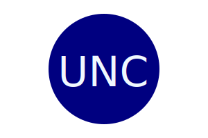
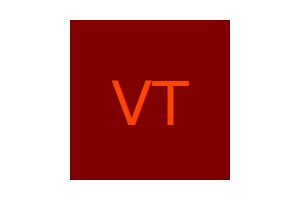
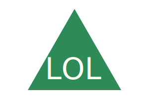

# SVG Logo Generator

[](https://opensource.org/licenses/MIT)

## Description
This is a command-line app that will generate a logo in the SVG file format. The logo can be in one of three shapes (circle, square, triangle) and can have text with up to three characters. Below are three examples of the types of images that can be generated.



## Table of Contents
- [Installation](#installation)
- [Use](#use)
- [Questions](#questions)
- [Contribution Guidelines](#contribution-guidelines)
- [Testing](#testing)
- [License](#license)

## Installation
This is a [Node.js](https://nodejs.org/en) app, it requires a working installation of Node and its npm package manager.

To install this app, download or clone the repo. Open a terminal and navigate to the app's directory and install the dependency (Inquirer) by typing `npm install` (or `npm i`). That will download the dependencies and store them in the node_modules subdirectory.

## Use
The app is [demonstrated in this video](https://youtu.be/m8sJYe22BaM).

Start the app from the command line by typing `node index.js`. You will see a series of prompts to collect the data needed to generate your logo.

```
1. What text (max 3 chars) do you want in your logo?
2. Enter text color by name or hex ([johndecember.com/html/spec/colorsvg.html]).
3. What shape do you want for your logo?
4. Enter shape color by name or hex (johndecember.com/html/spec/colorsvg.html).
```

For question 1, inputs of more than 3 chars are not allowed (but 0 characters is okay). For questions 2 and 4 you may use any one of the [147 colors listed](https://johndecember.com/html/spec/colorsvgsvg.html) in the SVG specification. Input that is not one of those names will not be allowed. You can also enter your color as a hex value; there is no validation of hex codes.

You may, of course, edit the SVG logo after it is generated; the logos are only four lines of XML. The listing below shows the file contents of the first logo in the images above.

```
<svg version="1.1" width="300" height="200" xmlns="http://www.w3.org/2000/svg">
  <circle cx="150" cy="100" r="80" fill="navy"/>
  <text x="150" y="125" font-size="60" text-anchor="middle" fill="aliceblue">UNC</text>
</svg>
```
The first line can be changed to tweak the size of the logo and the second line governs the shape and shape color. The third line determines the text and its size, color and placement within the logo. Read the [MDN documentation](https://developer.mozilla.org/en-US/docs/Web/SVG) for more information about SVGs, or an image editor ([Inkscape](https://inkscape.org) is free) for more complex tweaks.

## Questions
Reach out if you have questions that are not covered here.

- GitHub username: clstevenson
- email: chrislstevenson@gmail.com

## Contribution Guidelines
Pull requests are welcome!

## Testing
The Shapes class and its sub-classes Circle, Square, and Triangle, are tested using the `jest` module. There are a series of nine tests:

- three tests to check validation of the inputs when an object is created (against allowed text length and allowed color names)
- one test for each shape on the proper generation of the shape in the SVG file
- one test for each shape on the proper generation and placement of the test in the SVG file

Assuming you have installed the app as instructed above, `npm test` will run the tests.

## License
This project is licensed under the terms of the [MIT license](https://opensource.org/licenses/MIT).
